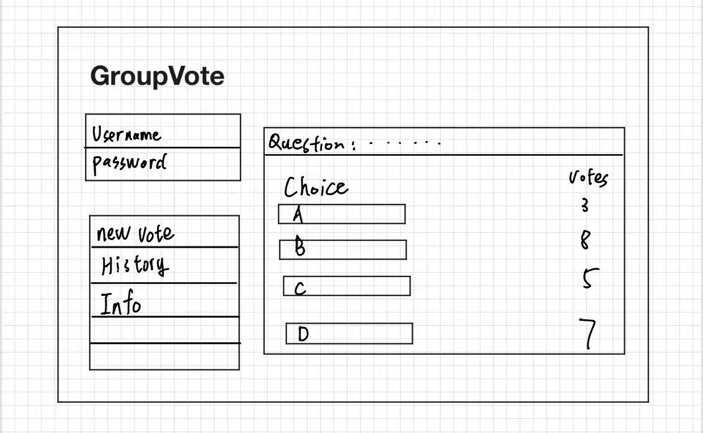
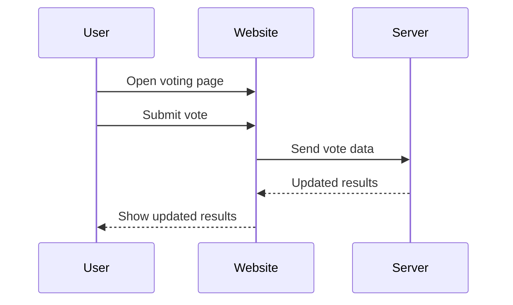

#   GroupVote

[My Notes](notes.md)

QuickVote is a simple web application that allows groups to vote on decisions in real time.

> [!NOTE]
> This is a template for your startup application. You must modify this `README.md` file for each phase of your development. You only need to fill in the section for each deliverable when that deliverable is submitted in Canvas. Without completing the section for a deliverable, the TA will not know what to look for when grading your submission. Feel free to add additional information to each deliverable description, but make sure you at least have the list of rubric items and a description of what you did for each item.

> [!NOTE]
> If you are not familiar with Markdown then you should review the [documentation](https://docs.github.com/en/get-started/writing-on-github/getting-started-with-writing-and-formatting-on-github/basic-writing-and-formatting-syntax) before continuing.

## 🚀 Specification Deliverable

> [!NOTE]
> Fill in this sections as the submission artifact for this deliverable. You can refer to this [example](https://github.com/webprogramming260/startup-example/blob/main/README.md) for inspiration.

For this deliverable I did the following. I checked the box `[x]` and added a description for things I completed.

- [x] Proper use of Markdown
- [x] A concise and compelling elevator pitch
- [x] Description of key features
- [x] Description of how you will use each technology
- [x] One or more rough sketches of your application. Images must be embedded in this file using Markdown image references.

### Elevator pitch

Have you ever struggled to make a group decision, such as choosing a restaurant, planning an activity, or deciding on a meeting time? GroupVote allows users to create a vote, share it with others, and see results update in real time. This helps groups quickly reach a decision without long discussions or confusion.

### Design

 
   The application will include a login page and a voting page. After logging in, users can view a list of voting     options and submit their vote. The voting results will be displayed and updated in real time as other users participate.

sequenceDiagram

### Key features

- User login
- Ability to create and view voting options
- Ability to cast and change a vote
- Real-time display of voting results
- Votes stored persistently
- Multiple users participating in the same vote

### Technologies

I am going to use the required technologies in the following ways.

- **HTML** - Provide the basic structure for the login and voting pages.
- **CSS** - Style the application with a clean layout.
- **React** - Create interactive components and handle routing between pages.
- **Service** - Backend endpoints to manage votes and retrieve results.
- **DB/Login** - Store user accounts and voting data.
- **WebSocket** - Send real-time vote updates to all connected users.
## 🚀 AWS deliverable

For this deliverable I did the following. I checked the box `[x]` and added a description for things I completed.

- [x] **Server deployed and accessible with custom domain name** - [My server link](https://easoncs260.click).

## 🚀 HTML deliverable

For this deliverable I did the following. I checked the box `[x]` and added a description for things I completed.

- [x] **HTML pages** - I complete this part of the deliverable.
- [x] **Proper HTML element usage** - I complete this part of the deliverable.
- [x] **Links** - I complete this part of the deliverable.
- [x] **Text** - I complete this part of the deliverable.
- [x] **3rd party API placeholder** - I complete this part of the deliverable.
- [x] **Images** - I complete this part of the deliverable.
- [x] **Login placeholder** - I complete this part of the deliverable.
- [x] **DB data placeholder** - I complete this part of the deliverable.
- [x] **WebSocket placeholder** - I complete this part of the deliverable.

**Summary of completed requirements:**
- Three HTML pages (index, history, info)
- Navigation links between pages
- Login placeholder with username display
- Database data placeholders in history page
- WebSocket placeholder for realtime updates
- Application images
- Third-party service placeholder

## 🚀 CSS deliverable

For this deliverable I did the following. I checked the box `[x]` and added a description for things I completed.

- [x] **Visually appealing colors and layout. No overflowing elements.** - I complete this part of the deliverable.
- [x] **Use of a CSS framework** - I complete this part of the deliverable.
- [x] **All visual elements styled using CSS** - I complete this part of the deliverable.
- [x] **Responsive to window resizing using flexbox and/or grid display** - I complete this part of the deliverable.
- [x] **Use of a imported font** - I complete this part of the deliverable.
- [x] **Use of different types of selectors including element, class, ID, and pseudo selectors** - I complete this part of the deliverable.

**Summary of CSS work completed:**
- Applied a consistent blue/white theme with cards and spacing
- Styled layout using Bootstrap grid plus custom flex/grid rules
- Imported and used the Manrope font site-wide
- Styled buttons, tables, badges, and alerts with CSS
- Used element, class, ID, and pseudo selectors in custom styles

## 🚀 React part 1: Routing deliverable

For this deliverable I did the following. I checked the box `[x]` and added a description for things I completed.

- [X] **Bundled using Vite** - I complete this part of the deliverable.
- [X] **Components** - I complete this part of the deliverable.
- [X] **Router** - I complete this part of the deliverable.

**Summary of React Part 1 work completed:**
- Ported GroupVote from multi-page HTML/CSS into a single-page React app.
- Created root React entry files (`index.html` + `index.jsx`) and mounted `App`.
- Migrated page-specific CSS into component folders under `src/`.
- Moved static assets into `public/` and updated image references.
- Replaced `deployFiles.sh` with `deployReact.sh` for React/Vite deployment.

## 🚀 React part 2: Reactivity deliverable

For this deliverable I did the following. I checked the box `[x]` and added a description for things I completed.

- [ ] **All functionality implemented or mocked out** - I did not complete this part of the deliverable.
- [ ] **Hooks** - I did not complete this part of the deliverable.

## 🚀 Service deliverable

For this deliverable I did the following. I checked the box `[x]` and added a description for things I completed.

- [ ] **Node.js/Express HTTP service** - I did not complete this part of the deliverable.
- [ ] **Static middleware for frontend** - I did not complete this part of the deliverable.
- [ ] **Calls to third party endpoints** - I did not complete this part of the deliverable.
- [ ] **Backend service endpoints** - I did not complete this part of the deliverable.
- [ ] **Frontend calls service endpoints** - I did not complete this part of the deliverable.
- [ ] **Supports registration, login, logout, and restricted endpoint** - I did not complete this part of the deliverable.

## 🚀 DB deliverable

For this deliverable I did the following. I checked the box `[x]` and added a description for things I completed.

- [ ] **Stores data in MongoDB** - I did not complete this part of the deliverable.
- [ ] **Stores credentials in MongoDB** - I did not complete this part of the deliverable.

## 🚀 WebSocket deliverable

For this deliverable I did the following. I checked the box `[x]` and added a description for things I completed.

- [ ] **Backend listens for WebSocket connection** - I did not complete this part of the deliverable.
- [ ] **Frontend makes WebSocket connection** - I did not complete this part of the deliverable.
- [ ] **Data sent over WebSocket connection** - I did not complete this part of the deliverable.
- [ ] **WebSocket data displayed** - I did not complete this part of the deliverable.
- [ ] **Application is fully functional** - I did not complete this part of the deliverable.

new marks

111
